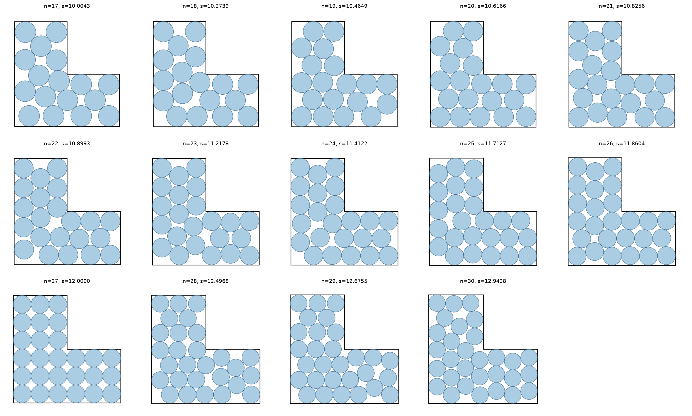

# Circles in an L-tromino, new records for n = 17 to 30

> **Note:** This repository was generated by Claude Opus 4.8. The author (Tej Stead)
> apologizes for the AI slop.

Problem ([`cirinl`](https://erich-friedman.github.io/packing/cirinl/)): pack `n` unit
circles in the smallest L-tromino. The L of size `s` is the square `[0,s] x [0,s]` with
the top-right quarter `[s/2, s] x [s/2, s]` removed, leaving three `s/2 x s/2` squares;
`s` is the outer (long) side. Minimize `s`.

The page only tabulates n = 1 to 16. This folder gives verified packings for n = 17 to
30: fourteen new entries. (n = 27 equals the trivial square-grid value 12; the other
thirteen are strictly smaller than any grid packing.)

## Records

See [`data/records.csv`](data/records.csv) for the table and
[`data/packings.json`](data/packings.json) for full center coordinates.

| n | side s | best trivial grid | n | side s | best trivial grid |
|---|--------|-------------------|---|--------|-------------------|
| 17 | 10.004254 | 10.660254 | 24 | 11.412241 | 12.0 |
| 18 | 10.273885 | 10.772846 | 25 | 11.712700 | 12.0 |
| 19 | 10.464897 | 10.928203 | 26 | 11.860387 | 12.0 |
| 20 | 10.616645 | 10.928203 | 27 | 12.000000 | 12.0 (= trivial) |
| 21 | 10.825649 | 11.0 | 28 | 12.496806 | 13.0 |
| 22 | 10.899276 | 12.0 | 29 | 12.675530 | 13.596697 |
| 23 | 11.217812 | 12.0 | 30 | 12.942845 | 14.0 |

The values increase monotonically in `n`, and each exceeds the published n = 16 record
(9.635).



Per-packing figures are in [`figures/svg/`](figures/svg/) (vector) and
[`figures/png/`](figures/png/) (300 dpi), one `nNN` file each.

## On closed forms

Most of these are numerical optima with several rattlers (free circles) and a positive
number of internal degrees of freedom, so no closed form is expected. Three packings are
structurally rigid (about 0 internal DOF) and so look analytic: n = 23, n = 25, and
n = 26, the last being the only non-trivial case with mirror symmetry across the L's
diagonal. Even so, their side lengths do not match any simple radical (`a + b√k` or
`a + b/√k`, searched to 1e-6); like most rigid disk packings they are roots of
higher-degree polynomials. The only exact value is the trivial n = 27 = 12.

## Verify

```bash
python3 ../common/verify.py cirinl
```

Every center sits exactly 1 from the walls and notch and every pair exactly 2 apart
(constraint residuals below 1e-9).
