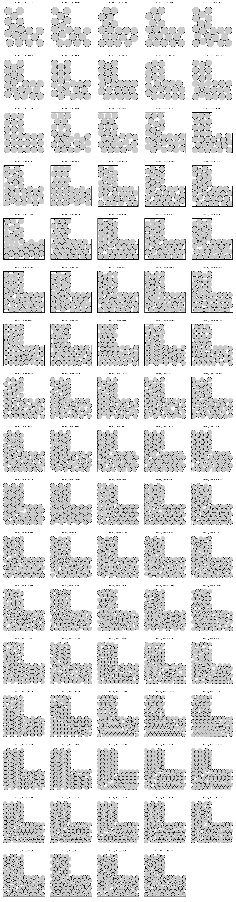

# Circles in an L-tromino, new records for n = 17 to 100

> **Note:** This repository was generated by Claude Opus 4.8. The author (Tej Stead)
> apologizes for the AI slop.

Problem ([`cirinl`](https://erich-friedman.github.io/packing/cirinl/)): pack `n` unit
circles in the smallest L-tromino. The L of size `s` is the square `[0,s] x [0,s]` with
the top-right quarter `[s/2, s] x [s/2, s]` removed, leaving three `s/2 x s/2` squares;
`s` is the outer (long) side. Minimize `s`.

The page only tabulates n = 1 to 16. This folder gives verified packings for **n = 17 to
100**: 84 entries. Each strictly beats the best trivial square/hexagonal grid except
n = 27, which ties it at exactly 12.

## Records

See [`data/records.csv`](data/records.csv) for the full table (`n`, `side_s`, the
trivial-grid baseline, and the improvement over it) and
[`data/packings.json`](data/packings.json) for the center coordinates.

The values increase monotonically in `n`, and each exceeds the published n = 16 record
(9.635). Each value was sought from several structured seedings (square grid, hexagonal
lattices in both row and column orientations, and an incremental seed carried from `n−1`)
plus random multistarts, then tightened by a perturbation/anneal polish and cross-checked
across independent runs; the smaller verified value is reported. All values are
best-known/numerical, not optimality proofs. Larger `n` are the likeliest to tighten
further with more search.

### Note: the square grid is not optimal beyond n = 27

A square grid of spacing 2 fills the L of size `s = 4k` with exactly `3k²` circles
(an `8×8` grid minus the removed `4×4` corner gives `48` at `s = 16`). For `k = 1,2,3`
(`n = 3,12,27`) this grid is optimal — even staggered/hexagonal seeds polish back to
`s = 4k`. The first `k` where it is beaten is **`k = 4` (`n = 48`)**: a staggered packing
fits 48 circles at **`s ≈ 15.9831 < 16`** (multiple independent optimizer seeds agree;
verified). (Best-known/numerical, not a proof of optimality.)

Diagrams in Erich Friedman's site style (gray fill, black outline, no center dots) are in
[`figures/`](figures/): small PNGs (`figures/png/`, sized so the outlines survive
downscaling) and crisp SVGs (`figures/svg/`), one `nNN` file each.



## Verify

```bash
python3 ../common/verify.py cirinl
```

Every center sits exactly 1 from the walls and notch and every pair exactly 2 apart
(constraint residuals below 1e-9).
