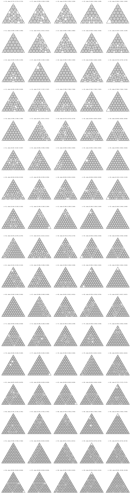

# Circles in an equilateral triangle, n = 16 to 100

> **Note:** This repository was generated by Claude Opus 4.8. The author (Tej Stead)
> apologizes for the AI slop.

Problem ([`cirintri`](https://erich-friedman.github.io/packing/cirintri/)): pack `n` unit
circles in the smallest equilateral triangle. The page tabulates n = 1 to 15. This folder
extends the table to **n = 16 to 100**.

## Attribution — this is a compilation, not original work

**The packings here are almost all due to others, chiefly Graham & Lubachevsky (1995).**
This folder collects the best-known packings from the literature, fills the gaps the
literature does not cover with our own optimizer, and provides verified coordinates and
figures for every `n` so the whole range can be checked and drawn. Credit for each `n` is
recorded in [`data/records.csv`](data/records.csv) (the `credit` column) and follows the
**earliest discoverer**:

| Source | What | n |
|--------|------|---|
| **Oler 1961 / Groemer 1960** | triangular numbers `n = k(k+1)/2`, proven optimal, `d = 1/(k-1)` | 21, 28, 36, 45, 55, 66, 78, 91 |
| **Erdős–Oler** | one-less-than-triangular `n = k(k+1)/2 - 1`, conjectured `d(n) = d(n+1)` | 20, 27, 35, 44, 54, 65, 77, 90 |
| **Melissen 1993 / Melissen & Schuur 1995** | small-n packings | 16, 17, 18 |
| **Graham & Lubachevsky 1995** | seven infinite families + tabulated/listed packings (n = 22–34 and beyond) | 36 entries |
| **this work (optimizer)** | `n` with no value in the literature we could source | 30 entries |

Where a packing belongs to a Graham–Lubachevsky infinite family but was first found
earlier (e.g. n = 16, 17 by Melissen & Schuur), credit goes to the earlier discoverer and
the family membership is noted in the `family_note` column. The key reference is:

> R. L. Graham and B. D. Lubachevsky, *Dense packings of equal disks in an equilateral
> triangle: from 22 to 34 and beyond*, Electronic Journal of Combinatorics **2** (1995), #A1.

See [`SOURCES.md`](SOURCES.md) for the full bibliography and per-`n` sourcing.

## Conventions

`d(n)` is the maximum–minimum pairwise distance between `n` points in a **unit-side**
equilateral triangle (the standard quantity Graham–Lubachevsky tabulate). It converts to
the side `s` of the smallest equilateral triangle holding `n` **unit-radius** circles by

```
s = 2 / d(n) + 2*sqrt(3).
```

[`data/records.csv`](data/records.csv) lists `n`, `side_s`, `d_unit`, exact radical
`side_exact`/`area_exact` where one exists, the credit, the kind of entry, whether it is
proven optimal, and any note. [`data/packings.json`](data/packings.json) has the full
circle-center coordinates and the three triangle vertices.

## What is proven vs. best-known

- **Proven optimal:** n ≤ 15 (on Friedman's page) and all triangular numbers
  `n = k(k+1)/2` (Oler/Groemer).
- **Best-known / conjectured:** everything else, including the Graham–Lubachevsky families
  and our optimizer's gap-fills. These are not optimality proofs.

31 of the 85 values are exact radicals in `sqrt(3)` (triangular, one-less-triangular, the
two closed-form GL families `4Δ(k)` and `2Δ(k+1)+2Δ(k)-1`, and several family-tie cases);
these carry `side_exact`/`area_exact` in the records. The rest are numerical.

## Verifying

```bash
python3 ../common/verify.py cirintri
```

For each packing it checks the minimum pairwise center distance (must be ≥ 2) and the
minimum distance from a center to a triangle edge (must be ≥ 1). Coordinates only; no
optimizer code is trusted.

## Figures

[`figures/`](figures/): per-`n` `png/nNN.png` and `svg/nNN.svg` in Erich Friedman's site
style (gray fill, black outline, no center dots), plus `all_packings.png`.


