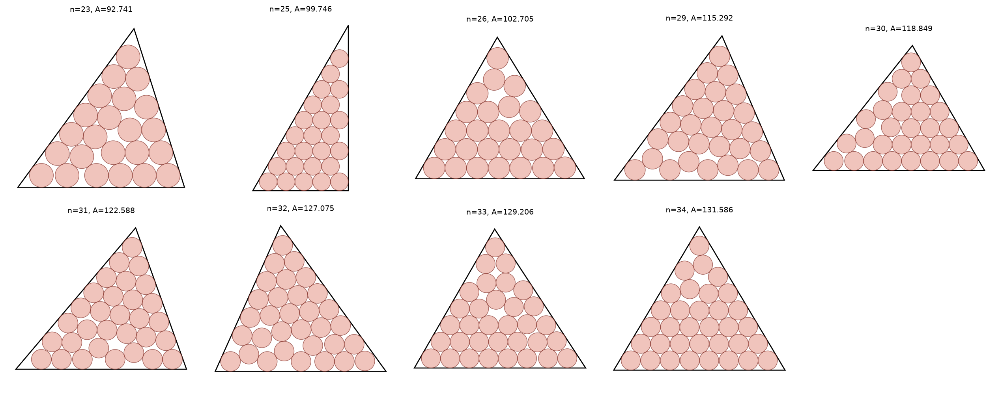

# Circles in arbitrary triangles, beating the equilateral default

> **Note:** This repository was generated by Claude Opus 4.8. The author (Tej Stead)
> apologizes for the AI slop.

Problem ([`cirinttt`](https://erich-friedman.github.io/packing/cirinttt/)): pack `n`
unit circles in the arbitrary triangle of smallest area. The triangle's three vertices
are free, so the shape itself is part of the optimization.

The page tabulates only `n` in {2, 4, 7, 8, 11, 12, 13, 16, 17, 18, 19, 22} and states:
"For n not shown, the best known packing is in an equilateral triangle." For `n` strictly
between triangular numbers, a tailored non-equilateral triangle does better than that
equilateral fallback. This folder gives nine such improvements.

## Improvements over the best-known equilateral packing

The baseline is not a naive equilateral arrangement. It is the optimal equilateral disk
packing from Graham & Lubachevsky, "Dense packings of equal disks in an equilateral
triangle: from 22 to 34 and beyond", Electron. J. Combin. 2 (1995), #A1, which covers
exactly this range. Their tabulated `d(n)` (the max-min center distance in a unit-side
triangle) converts to the smallest equilateral side holding `n` unit circles via
`s = 2/d(n) + 2√3`, hence area `(√3/4)s²`. Values are in
[`data/gl_baselines.json`](data/gl_baselines.json).

Each of the nine arbitrary-triangle packings beats that best-known equilateral area:

| n | new area (arbitrary triangle) | best-known equilateral (G-L 1995) | improvement | shape |
|---|------------------------------|----------------------------------:|------------:|-------|
| 23 | 92.74138  | 95.90965  | 3.17 | isosceles |
| 25 | 99.74613  | 101.28194 | 1.54 | right (exact, see below) |
| 26 | 102.70487 | 103.48085 | 0.78 | scalene |
| 29 | 115.29224 | 119.40154 | 4.11 | scalene |
| 30 | 118.84862 | 121.19845 | 2.35 | scalene |
| 31 | 122.58804 | 124.08588 | 1.50 | scalene |
| 32 | 127.07490 | 128.81089 | 1.74 | scalene |
| 33 | 129.20635 | 131.19680 | 1.99 | scalene |
| 34 | 131.58592 | 132.04811 | 0.46 | isosceles |

See [`data/records.csv`](data/records.csv) and [`data/packings.json`](data/packings.json).
The n = 24, 27, 28, 35 cases, where the equilateral triangle is itself optimal, are not
claimed.



Per-packing figures are in [`figures/svg/`](figures/svg/) (vector) and
[`figures/png/`](figures/png/) (300 dpi), one `nNN` file each.

### Exact closed form for n = 25

The n = 25 optimum is a 30-60-90 right triangle:

* short leg `9 + √3`, long leg `3 + 9√3`, hypotenuse `18 + 2√3`
* area `27 + 42√3` ≈ 99.746134

Constructing the packing analytically (25 circles in a hexagonal arrangement at side
`9 + √3`) gives wall clearance and pair distance equal to exactly 1 and 2 to 12 digits.

## Verify

```bash
python3 ../common/verify.py cirinttt
```
