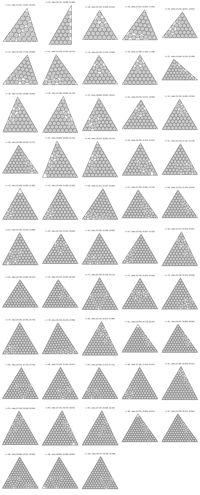

# Circles in arbitrary triangles, beating the equilateral default

> **Note:** This repository was generated by Claude Opus 4.8. The author (Tej Stead)
> apologizes for the AI slop.

Problem ([`cirinttt`](https://erich-friedman.github.io/packing/cirinttt/)): pack `n`
unit circles in the arbitrary triangle of smallest area. The triangle's three vertices
are free, so the shape itself is part of the optimization.

The page tabulates only `n` in {2, 4, 7, 8, 11, 12, 13, 16, 17, 18, 19, 22} and states:
"For n not shown, the best known packing is in an equilateral triangle." For `n` strictly
between triangular numbers, a tailored non-equilateral triangle does better than that
equilateral fallback. This folder gives:

- the original **fifteen** improvements at n = 23, 25, 26, 29–34, 37–39, 41–43 (detailed
  table below), and
- a further **38 new records at n = 46 to 100** (n = 46, 47, 48, 50–53, 56–58, 61–63,
  67–70, 72–75, 79–82, 85–88, 92–100), each beating our own best equilateral packing for
  that `n`. See [`data/records.csv`](data/records.csv) for the full table and
  [`data/packings.json`](data/packings.json) for coordinates.

The remaining `n` up to 100 — those at and just around triangular numbers (n = 44, 45, 49,
54, 55, 59, 60, 64–66, 71, 76–78, 83, 84, 89–91) — are **not** claimed: there the
equilateral triangle is the best we know, so no separate cirinttt entry is warranted.

## Improvements over the best-known equilateral packing

The baseline is not a naive equilateral arrangement. It is the optimal equilateral disk
packing from Graham & Lubachevsky, "Dense packings of equal disks in an equilateral
triangle: from 22 to 34 and beyond", Electron. J. Combin. 2 (1995), #A1, which covers
exactly this range. Their tabulated `d(n)` (the max-min center distance in a unit-side
triangle) converts to the smallest equilateral side holding `n` unit circles via
`s = 2/d(n) + 2√3`, hence area `(√3/4)s²`. Values are in
[`data/gl_baselines.json`](data/gl_baselines.json). G-L tabulates n = 22 to 34; for
n = 38, 39, 41 (not individually listed there) a heavy independently-validated
equilateral solve is used, labeled as such in `data/records.csv`.

Each of the fifteen arbitrary-triangle packings beats that best-known equilateral area:

| n | side lengths $(a,b,c)$ | new area | best-known equilateral | improvement | shape |
|---|------------------------|---------:|----------------------:|------------:|-------|
| 23 | 13.9511, 13.9511, 16.4715 | 92.74138  | 95.90966  | 3.17 | isosceles |
| 25 | 10.7321, 18.5885, 21.4641 | 99.74613  | 101.28194 | 1.54 | right (exact, see below) |
| 26 | 15.1541, 15.4089, 15.6517 | 102.70487 | 103.48086 | 0.78 | scalene |
| 29 | 15.2528, 16.4654, 17.4562 | 115.29224 | 119.40154 | 4.11 | scalene |
| 30 | 15.2021, 16.8109, 18.0547 | 118.84862 | 121.19845 | 2.35 | scalene |
| 31 | 15.1539, 17.1916, 18.6820 | 122.58804 | 124.08588 | 1.50 | scalene |
| 32 | 16.1494, 17.2499, 18.1720 | 127.07490 | 128.81089 | 1.74 | scalene |
| 33 | 16.7258, 17.3098, 17.8400 | 129.20635 | 131.19680 | 1.99 | scalene |
| 34 | 17.2899, 17.2899, 17.7281 | 131.58592 | 132.04811 | 0.46 | isosceles |
| 37 | 14.9435, 19.7559, 22.3987 | 144.93603 | 148.69955 | 3.76 | scalene |
| 38 | 17.2431, 18.6965, 19.8717 | 148.37141 | 151.90787 | 3.54 | scalene |
| 39 | 17.2057, 18.9923, 20.3792 | 151.83073 | 154.93997 | 3.11 | scalene |
| 41 | 18.6645, 19.2633, 19.8109 | 160.11055 | 161.18946 | 1.08 | scalene |
| 42 | 18.7305, 19.3746, 19.9601 | 161.88709 | 163.07781 | 1.19 | scalene |
| 43 | 19.3499, 19.4456, 19.5398 | 163.71933 | 164.03817 | 0.32 | scalene |

Side lengths above are sorted $a\le b\le c$ (full precision in
[`data/records.csv`](data/records.csv); complete coordinates in
[`data/packings.json`](data/packings.json)). Most of these triangles have one interior
angle very close to 60° (the two exceptions, n = 23 and n = 34, are isosceles); this
appears to reflect a hexagonal-lattice corner but is an empirical observation, not a
proven fact. The n = 24, 27, 28, 35, 36, 40, 44 cases, where the equilateral triangle is
itself optimal, are not claimed.

## The n = 46–100 records

These 38 entries were found by deforming our own best equilateral packing (see the
companion `cirintri_circles_in_equilateral_triangles/` folder, n = 16–100) into an
arbitrary triangle and minimizing area. Each beats that equilateral packing's area; the
baseline used per `n` is our equilateral area, recorded in the `best_equilateral_area`
column of [`data/records.csv`](data/records.csv) with source
`equilateral (this project, n=16-100 extension)`. As with the original fifteen, these are
best-known/numerical, not optimality proofs. The same near-triangular `n` that favor the
equilateral arrangement (listed above) show no improvement and are omitted.

Diagrams in Erich Friedman's site style (gray fill, black outline, no center dots) are in
[`figures/`](figures/): small PNGs (`figures/png/`, sized so the outlines survive
downscaling) and crisp SVGs (`figures/svg/`), one `nNN` file each, with the side
lengths captioned in the overview below.



### Exact closed form for n = 25

The n = 25 optimum is a 30-60-90 right triangle: short leg `9 + √3`, long leg `3 + 9√3`,
hypotenuse `18 + 2√3`, area `27 + 42√3` ≈ 99.746134 (exact).

## Verify

```bash
python3 ../common/verify.py cirinttt
```
